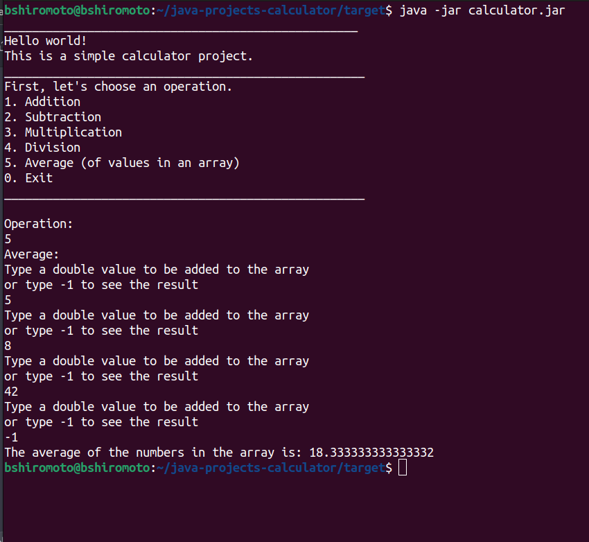

# 🔢 Java Calculator

## 🇺🇸 About this project

This is a basic Java calculator project that supports fundamentals operations such as addition, subtraction, multiplication, division and finding the average for a set of values.

## 📝 Installation/Usage

> ⚠️ Be sure you have JRE (Java Runtime Environment) installed

1. Download and extract the `.zip` file 
2. Using the terminal, navigate to the project's `target` directory
3. Run the `.jar` file using the command `java -jar calculator.jar`

> 💬 If you have any suggestions or feedbacks, I would be happy to recieve them through <a href="https://www.linkedin.com/in/bshiromoto/" target="_blank">LinkedIn</a>!

## 🇧🇷 Sobre este projeto

Este repositório contém alguns projetos desenvolvidos para treinar minhas habilidades em Java.

Você pode achar informações mais detalhadas sobre cada projeto no `README` da branch.

## 📝 Instalação/Uso

> ⚠️ Certifique-se de ter o JRE (Java Runtime Environment) instalado.

1. Faça o download e extraia o arquivo `.zip`
2. Usando o terminal, navegue até o diretório `target` do projeto
3. Execute o arquivo `.jar` usando o comando `java -jar calculator.jar`

> 💬 Se tiver alguma sugestão ou feedback, eu ficaria feliz em recebê-los pelo meu <a href="https://www.linkedin.com/in/bshiromoto/" target="_blank">LinkedIn</a>!

## 🖼️ Screenshots

  
  </img>

## 🛠️ Technologies used/Tecnologias utilizadas
### Programming languages/Linguagens de programação:

### Frameworks and libraries/Frameworks e bibliotecas:

### Tools and platforms/Ferramentas e plataformas:

